# SCPH Notify 2026

ระบบแจ้งเตือนข้อมูลผู้ป่วยจาก HOSxP สำหรับจุดบริการ — แปลงจากโปรเจกต์เดิม `D:\VB Project\ScphNotify`
(VB.NET / .NET Framework 4.6.1) มาเป็น **Visual Basic บน .NET 10 สำหรับ Visual Studio 2026** พร้อมออกแบบหน้าจอใหม่ทั้งหมด

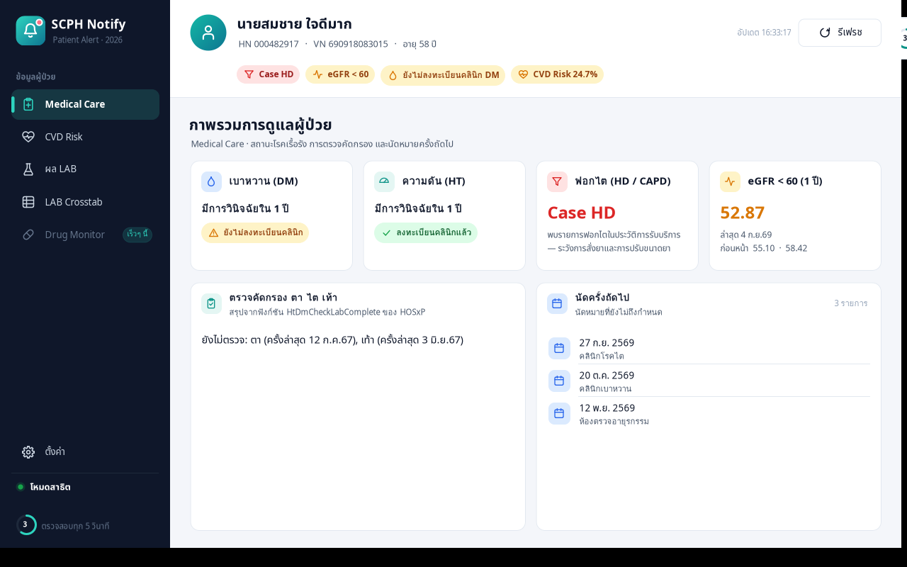

---

## เริ่มใช้งาน

**สิ่งที่ต้องมี**
- Visual Studio 2026 ที่ติดตั้ง workload **.NET desktop development** (มี .NET 10 SDK มาด้วย)
- Windows 10 / 11
- ฐานข้อมูล HOSxP บน MySQL 5.5 ขึ้นไป หรือ MariaDB 10 ขึ้นไป

**เปิดโปรเจกต์**
1. เปิด `ScphNotify.sln` ด้วย Visual Studio 2026
2. กด **F5** — การ build ครั้งแรกจะดาวน์โหลด NuGet package ให้เอง (`MySqlConnector 2.6.2`, `System.Security.Cryptography.ProtectedData 10.0.0`)
3. ถ้าจะดูหน้าจอโดยไม่ต่อฐานข้อมูล ให้ใส่ `--demo` ที่ Project Properties → Debug → Command line arguments
   (หรือรัน `ScphNotify.exe --demo`) ระบบจะใช้ข้อมูลสมมติ

**แจกจ่ายไปเครื่องอื่น** — รัน `.\publish.ps1 -Installer` จะได้ `dist\ScphNotify-Setup-2.0.0.0.exe`
เครื่องปลายทางไม่ต้องติดตั้ง .NET ก่อน (ดูหัวข้อ [Build และสร้างตัวติดตั้ง](#build-และสร้างตัวติดตั้ง))

**ตั้งค่าฐานข้อมูล**
- ค่าเริ่มต้นอยู่ใน `ScphNotify\appsettings.json` (ย้ายมาจาก `DB_SERVER / DB_NAME / USERNAME / PASSWORD` ใน App.config เดิม)
- ผู้ใช้เปลี่ยนเองได้ที่ **Ctrl+F6** (เหมือนเดิม) หรือเมนู ตั้งค่า → ตั้งค่าการเชื่อมต่อ
  ค่าที่บันทึกจะเก็บที่ `%LOCALAPPDATA%\ScphNotify\settings.json` และรหัสผ่านถูกเข้ารหัสด้วย Windows DPAPI
- **หน้าตั้งค่าฐานข้อมูลเปิดได้เฉพาะผู้ดูแลระบบ** — ต้องล็อกอินด้วยบัญชี HOSxP ก่อน (ดูหัวข้อถัดไป)

**สิทธิ์ผู้ดูแลระบบ (ใหม่)**

ก่อนเปิดหน้าตั้งค่าฐานข้อมูล โปรแกรมจะถามชื่อผู้ใช้/รหัสผ่านของ HOSxP
ใช้วิธีเดียวกับโปรแกรม `Appoint2020` ของโรงพยาบาล คือ

```sql
SELECT loginname FROM opduser WHERE loginname = ? AND passweb = MD5(?)
-- สิทธิ์ผู้ดูแลระบบ: opduser.groupname = 'admin'  (หรือ accessright ตามที่กำหนด)
```

ปรับได้ที่ส่วน `Security` ใน `appsettings.json`

| ค่า | ความหมาย |
|---|---|
| `RequireAdminLogin` | `false` = ปิดการตรวจสิทธิ์ (เหมือนเวอร์ชันเดิม) |
| `PasswordColumns` | คอลัมน์รหัสผ่านที่จะลองตามลำดับ — ค่าเริ่มต้น `[ "passweb", "password", "passwordx" ]` (คอลัมน์ที่ค่าว่างจะถูกข้าม) |
| `PasswordModes` | วิธีเทียบที่จะลองตามลำดับ: `Md5` `Plain` `Sha1` `MySqlPassword` `EncodeBms` `EncodeHos` |
| `AdminGroups` | กลุ่มที่ถือว่าเป็นผู้ดูแลระบบ — ค่าเริ่มต้น `[ "admin" ]` |
| `AccessRightKeyword` | ถ้าใส่ไว้ บัญชีที่ `accessright` มีข้อความนี้จะเป็นแอดมินด้วย |
| `AdminLogins` | รายชื่อที่อนุญาตเพิ่ม ไม่ว่ากลุ่มจะเป็นอะไร เช่น `[ "komsan" ]` |
| `AllowHosxpSessionLogin` | แสดงปุ่ม **"เข้าด้วยบัญชี HOSxP บนเครื่องนี้"** (อ่านจาก `onlineuser` เหมือนช่อง "Login by pass HOSxP" ของ Appoint2020) — ต้องกดปุ่มเอง ไม่เข้าสู่ระบบอัตโนมัติ |

ข้อความแจ้งเมื่อเข้าไม่ได้จะแยกให้ชัดว่า **ไม่พบชื่อผู้ใช้** / **ยังไม่ได้ตั้งรหัสผ่านสำหรับโปรแกรมภายนอกใน HOSxP (คอลัมน์ว่าง)** /
**รหัสผ่านไม่ถูกต้อง** / **ไม่มีสิทธิ์ผู้ดูแลระบบ (พร้อมชื่อกลุ่ม)**

หลังล็อกอินผ่าน หัวหน้าต่างจะแสดง `[Connect <server> # db : <database>]` ต่อท้าย — ก่อนล็อกอินจะซ่อนชื่อเซิร์ฟเวอร์ไว้
(หน้าตั้งค่าและ tooltip ก็ซ่อนเช่นกัน)

> 🔑 **ถ้าต่อฐานข้อมูลไม่ได้จนล็อกอินไม่ได้** ให้เปิดด้วย `ScphNotify.exe --dbconfig`
> จะเข้าหน้าตั้งค่าได้โดยไม่ตรวจสิทธิ์ (ใช้สำหรับกู้คืนเท่านั้น)

---

## หน้าจอใหม่

| หน้าจอ | แทนของเดิม | สิ่งที่เปลี่ยน |
|---|---|---|
| แถบแจ้งเตือนลอย (`NotifierWidget`) | `dialogMain` | แถบมุมโค้งอยู่บนสุด ลากย้ายได้และจำตำแหน่ง, จุดสถานะการเชื่อมต่อ, ป้ายเตือนสำคัญ (Case HD, eGFR < 60 …), วงแหวนนับถอยหลัง, คลิกเพื่อเปิดหน้าหลัก, เมนูคลิกขวา, ซ่อนไปถาดระบบ |
| หน้าต่างหลัก (`MainShell`) | `frmMain` | เมนูด้านซ้ายแบบมีไอคอน+ชื่อ, หัวข้อมูลผู้ป่วย + ป้ายเตือน, ปรับขนาดหน้าต่างได้, F5 = รีเฟรช |
| Medical Care | `dialogMedicalCare` | การ์ดสถานะ DM / HT / ฟอกไต / eGFR, ตรวจคัดกรองตาไตเท้า, รายการนัดครั้งถัดไป |
| CVD Risk | `dialogHart` | คะแนนล่าสุด, แถบระดับความเสี่ยง 5 ระดับพร้อมตัวชี้, ตาราง, กราฟแนวโน้ม |
| ผล LAB | `dialogLab` | ค้นหา/เลือกช่วงปี, สลับ ตาราง ↔ กราฟ, Flag สีแดง/น้ำเงิน, พิมพ์รายงาน |
| LAB Crosstab | `dialogLabCrossTab` | **ทำให้ใช้งานได้จริง** — เลือกหลายรายการแล้วสร้างตารางเทียบผลตามวันที่ |
| ตั้งค่า | `dialogSetting` | สวิตช์เปิด/ปิดการแสดงผลต่อเครื่อง, ความถี่ตรวจสอบ, อยู่บนสุดเสมอ, ข้อมูลฐานข้อมูล |
| ตั้งค่าฐานข้อมูล | `frmConfig` (`dialogConfig`) | ช่องกรอกแบบใหม่, พอร์ต, ปุ่มแสดงรหัสผ่าน, ผลการทดสอบแสดงในหน้าเดียวกัน |
| คัดกรองโรคจากการทำงาน | `dialogOccupational` | ตัวเลือก ใช่/ไม่ใช่ แบบปุ่ม, แถบเตือนเปลี่ยนเป็นสีแดงเมื่อมีคำตอบ "ใช่", เปิด/ปิดทั้งระบบได้จากหน้าตั้งค่า |
| **LAB Template Hemodialysis** | *(ไม่มีในของเดิม)* | หน้าใหม่ — ชุดผล LAB มาตรฐานของผู้ป่วยฟอกไต แบบเดียวกับหน้า QHis2 `emr_html/fcontent_lab_hd.php` : แถวคือรายการตามเทมเพลต คอลัมน์คือวันที่รายงานผล (ล่าสุด 10 ครั้ง) เลือกช่วงวันที่ได้ ผลหลายค่าในวันเดียวกันแสดงคั่นด้วย `\|` ส่งออก CSV และ **พิมพ์ใบ LAB** (ตัวอย่างก่อนพิมพ์ หน้าตาเหมือนไฟล์ PDF ของ QHis2) · แก้รายการ/ลำดับได้ที่ `appsettings.json` ส่วน `LabHemodialysis` |
| **HD/CAPD Care** | *(ไม่มีในของเดิม)* | หน้าใหม่ — ภาพรวมผู้ป่วยบำบัดทดแทนไต · **ส่วนบน = ข้อมูลจริงจาก HOSxP** (ชนิด/ความถี่การล้างไตจาก `opitemrece` + `nondrugitems`, น้ำหนัก/ความดันจาก `ovst` + `opdscreen`, ผล LAB สำคัญพร้อมช่วงเป้าหมายและลูกศรเทียบครั้งก่อน, ยาที่เกี่ยวข้อง) · **ส่วนล่าง = ตัวอย่างหน้าจอ** (Dry weight, UF, BFR, Inflow/Outflow, Exit site, อาการเฝ้าระวัง) ซึ่ง HOSxP ไม่ได้เก็บ ต้องสร้างตารางเพิ่มก่อน — ดูหัวข้อ "HD/CAPD Care: กลุ่ม A / กลุ่ม B" |
| **โหมดค้นหาผู้ป่วยเอง (Manual)** | *(ไม่มีในของเดิม)* | สลับจากโหมดรอเรียกอัตโนมัติมาเลือกผู้ป่วยเองได้ ค้นด้วยชื่อ / ชื่อ-สกุล / HN / เลขบัตรประชาชน โดยไม่ต้องมารับบริการวันนี้ — ถ้าไม่ได้มาวันนี้จะขึ้นป้ายเตือน "ผู้ป่วยไม่ได้มารับบริการในวันนี้" · ปิดหน้าต่างหลักเมื่อไรจะกลับสู่โหมดอัตโนมัติเสมอ |
| **ทะเบียนโรคจากการทำงานและ PM2.5** | *(ไม่มีในของเดิม)* | หน้าใหม่ — เปิดจากเมนูของแถบแจ้งเตือน (คลิกขวา หรือปุ่ม ⋮) · ดูผลคัดกรองย้อนหลังจาก `opdscreen_occupational` เลือกช่วงวันที่ ค้นหา HN/VN/ชื่อ/ผู้บันทึก การ์ดสรุป 4 ตัว และส่งออก CSV เปิดด้วย Excel |
| **เข้าสู่ระบบผู้ดูแล** | *(ไม่มีในของเดิม)* | หน้าใหม่ — ล็อกอินด้วยบัญชี HOSxP (`opduser`) ก่อนเข้าหน้าตั้งค่าฐานข้อมูล |
| รายงานผล LAB | `rptLabReport` (Crystal Reports) | ตัวอย่างก่อนพิมพ์ + กราฟ + ตาราง แบ่งหน้าอัตโนมัติ |
| แจ้งข้อผิดพลาด | `MessageBox` + `popUpMySqlTrace` | กล่องข้อความเดียว มีปุ่มแสดงรายละเอียด/SQL และคัดลอก |

ภาพหน้าจอทั้งหมดอยู่ใน `docs/screenshots` (ถ่ายจากโหมดสาธิต ข้อมูลเป็นข้อมูลสมมติ — บน Windows จริงจะใช้ฟอนต์ Leelawadee UI)

<p>
<br>
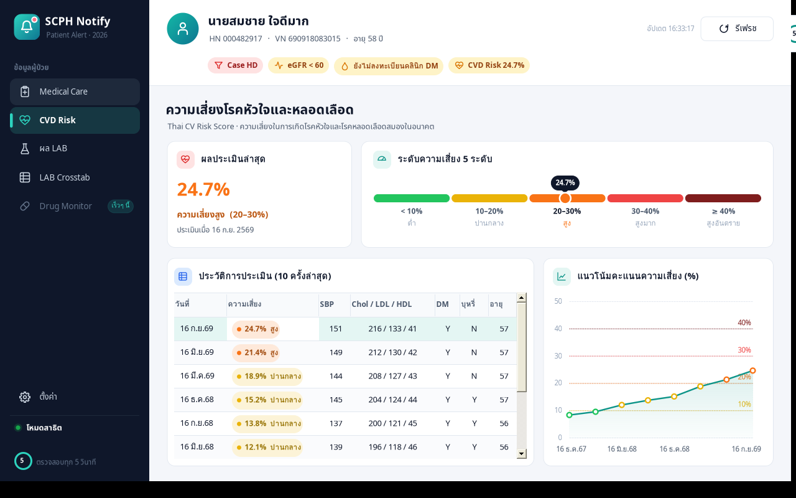 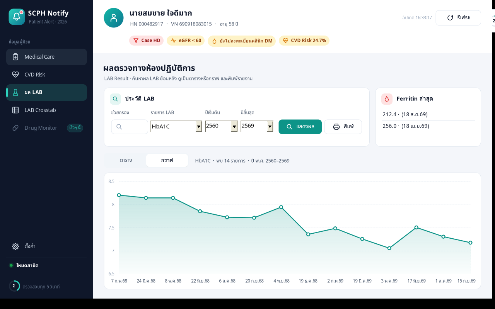
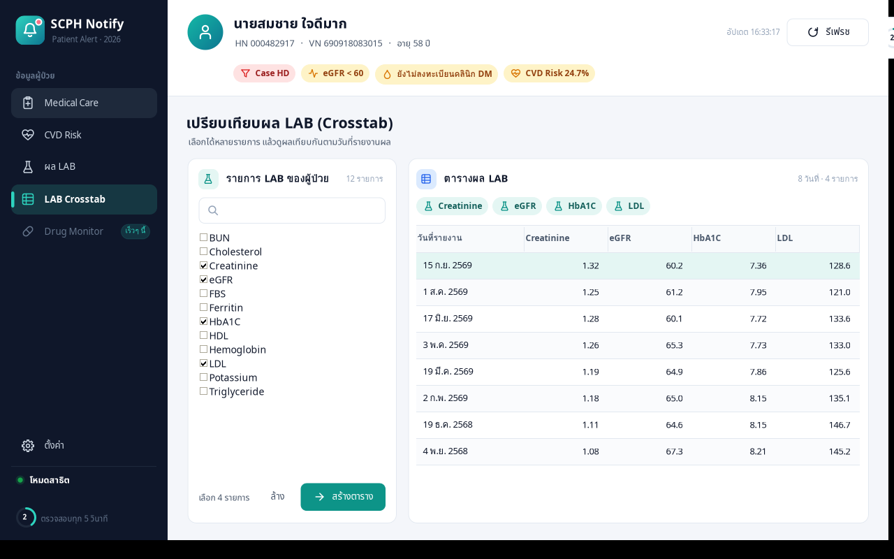 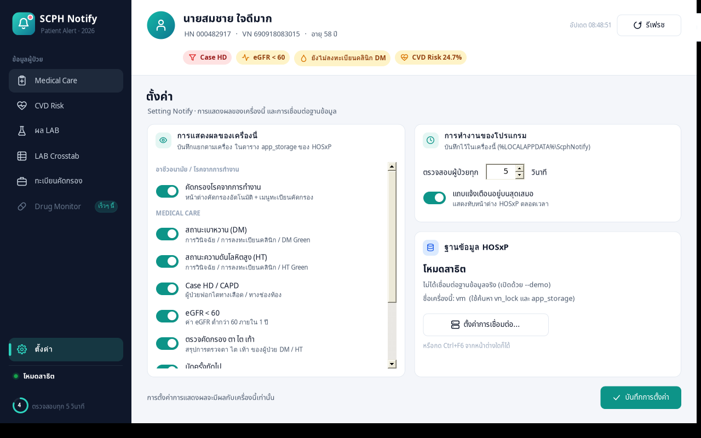
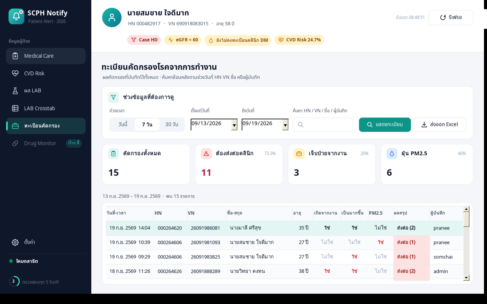 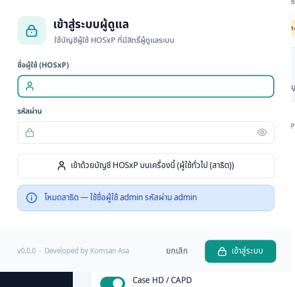
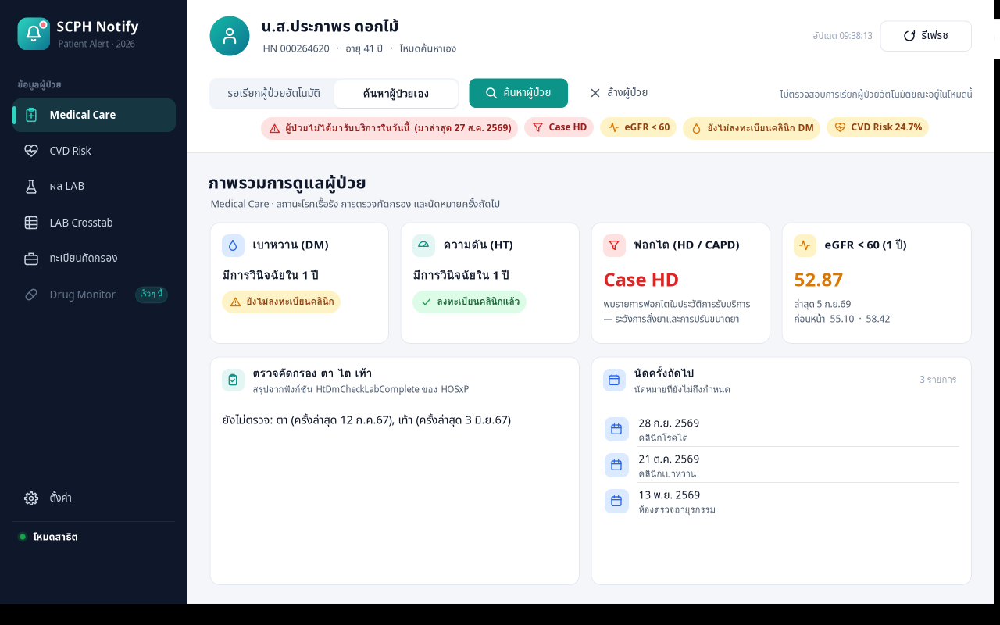 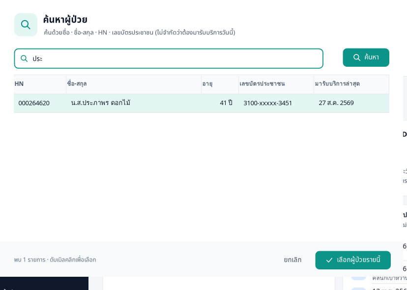
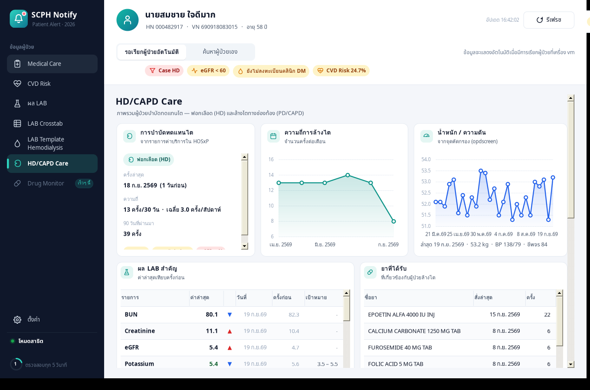 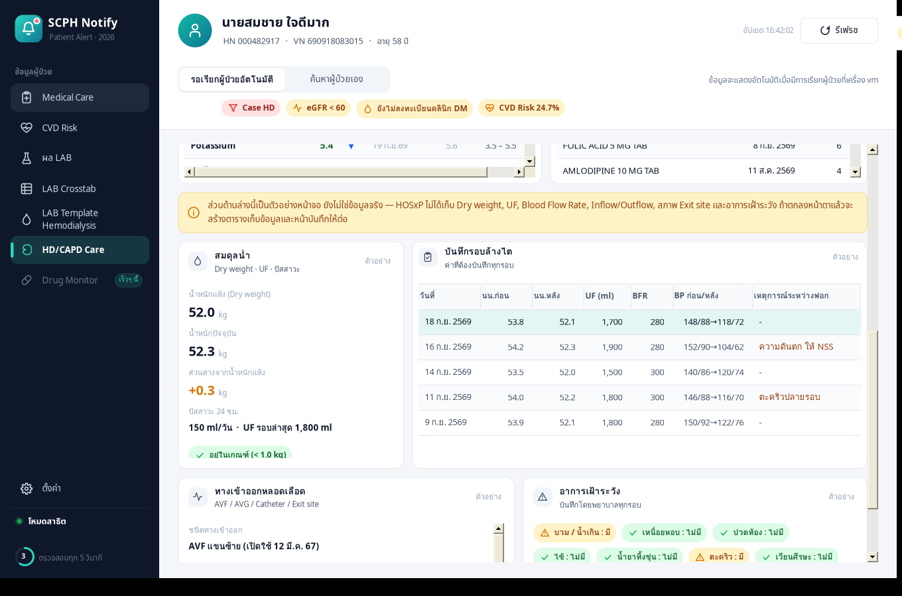
</p>

---

## HD/CAPD Care: กลุ่ม A / กลุ่ม B

หน้านี้แบ่งชัดเจนตาม **ที่มาของข้อมูล** เพราะ HOSxP เก็บข้อมูลผู้ป่วยล้างไตไว้ราวครึ่งเดียวของที่ควรมี

**กลุ่ม A — ใช้งานได้จริงแล้ว** (ไม่ต้องสร้างตารางเพิ่ม)

| แสดงอะไร | มาจากตาราง | หมายเหตุ |
|---|---|---|
| ชนิดการล้างไต (HD / PD) · ครั้งล่าสุด · จำนวนครั้ง 30/90 วัน · เฉลี่ยครั้ง/สัปดาห์ | `opitemrece` + `nondrugitems` | อนุมานจาก **รายการค่าบริการ** 1 วัน = 1 รอบ · แต่ละโรงพยาบาลตั้งชื่อรายการไม่เหมือนกัน แก้คำค้นได้ที่ `appsettings.json` ส่วน `Dialysis.HdKeywords` / `PdKeywords` |
| กราฟความถี่การล้างไตรายเดือน | เช่นเดียวกัน | ย้อนหลังตาม `Dialysis.Months` (เริ่มต้น 6 เดือน) |
| น้ำหนัก / ความดัน / ชีพจร | `ovst` + `opdscreen` | ค่าที่จุดคัดกรอง ไม่ใช่น้ำหนักก่อน-หลังฟอก |
| ผล LAB สำคัญ + ช่วงเป้าหมาย + ลูกศรเทียบครั้งก่อน | `lab_head` + `lab_order` | รายการและลำดับแก้ได้ที่ `Dialysis.LabItems` · ช่วงเป้าหมายใช้เตือนบนหน้าจอเท่านั้น |
| ยาที่เกี่ยวข้อง (EPO, phosphate binder, ยาลดความดัน ฯลฯ) | `opitemrece` + `drugitems` | ค้นชื่อยาแบบ LIKE ตาม `Dialysis.DrugKeywords` |

**กลุ่ม B — ยังเป็นตัวอย่างหน้าจอ** (HOSxP ไม่ได้เก็บ ทุกการ์ดมีป้าย "ตัวอย่าง" กำกับ และมีแถบเตือนสีเหลืองคั่นไว้)

น้ำหนักแห้ง (Dry weight) · UF ต่อรอบ · น้ำหนักก่อน/หลังฟอก · Blood Flow Rate · ความดันระหว่างฟอก ·
Inflow/Outflow และ Dwell time ของ PD · ลักษณะน้ำยาทิ้ง (ใส/ขุ่น/มีเลือดปน) · สภาพ AVF-AVG-Catheter และ Exit site ·
ปริมาณปัสสาวะต่อวัน · checklist อาการเฝ้าระวัง

ถ้าจะทำให้ใช้งานได้จริง ต้องสร้างตารางเสริมใน HOSxP แล้วให้ ScphNotify อ่าน/เขียนเอง
แบบเดียวกับที่ทำไว้แล้วกับ `opdscreen_occupational` (ประมาณ 2 ตาราง: ระดับผู้ป่วย และระดับรอบการล้างไต) พร้อมหน้าบันทึกสำหรับพยาบาล

---

## โครงสร้างโปรเจกต์

```
ScphNotify.sln
publish.ps1                สร้างชุดแจกจ่าย (dist\app) และตัวติดตั้ง — ดูหัวข้อ "Build และสร้างตัวติดตั้ง"
build-installer.cmd        ดับเบิลคลิกเพื่อรัน publish.ps1 -Installer (เก็บผลไว้ที่ build.log)
installer\
  ScphNotify.iss           สคริปต์ Inno Setup ของตัวติดตั้ง
ScphNotify\
  ScphNotify.vbproj        SDK-style, net10.0-windows, Option Strict On
  Program.vb               จุดเริ่มโปรแกรม, เปิดซ้ำได้ครั้งเดียว (Mutex), --demo
  appsettings.json         ค่าเชื่อมต่อฐานข้อมูลเริ่มต้น
  Core\                    Models (PatientSnapshot ฯลฯ), AppConfig (JSON + DPAPI), ThaiDate
  Data\                    IHosRepository, MySqlHosRepository (SQL ทั้งหมด), DemoHosRepository
  Services\                PatientMonitor (ตัวจับเวลาเดียว), ClinicalRules, LabReportPrinter, AppSession
  UI\Theme.vb              สี / ฟอนต์ / ระยะ — ปรับโทนทั้งโปรแกรมได้ที่ไฟล์นี้
  UI\IconPainter.vb        ไอคอนเวกเตอร์ (ไม่ต้องใช้ไฟล์รูป)
  UI\Controls\             คอนโทรลที่วาดเอง: CardPanel, NavButton, ModernButton, StatusChip,
                           ToggleSwitch, SegmentedControl, LineChart, ModernTextBox, ModernListBox ฯลฯ
  UI\Forms\                NotifierWidget, MainShell, DbConfigDialog, OccupationalScreeningDialog, ErrorDialog
  UI\Pages\                MedicalCarePage, CvdRiskPage, LabPage, LabCrossTabPage, LabHemodialysisPage,
                           HdCapdCarePage, OccupationalRegistryPage, DrugPage, SettingsPage
```

ทุก Form / UserControl มีไฟล์ `.Designer.vb` แบบมาตรฐาน เปิดแก้ใน Windows Forms Designer ได้
(คอนโทรลใน `UI\Controls` จะขึ้นใน Toolbox หลัง build ครั้งแรก)

---

## เปลี่ยนอะไรทางเทคนิค

- **.NET Framework 4.6.1 → .NET 10** (โปรเจกต์แบบ SDK-style)
- **MySql.Data 6.6.5 → MySqlConnector 2.6.2** และ SQL ทุกคำสั่งเปลี่ยนจากการต่อ string เป็น parameter (`@hn`) กัน SQL Injection
- **Crystal Reports → PrintDocument / PrintPreviewDialog** (Crystal Reports runtime เดิมผูกกับ .NET Framework)
- **MSChart (System.Windows.Forms.DataVisualization) → `LineChart` ที่เขียนเอง** (MSChart ไม่มีใน .NET 10)
- **App.config → appsettings.json** และค่าที่ผู้ใช้บันทึกเก็บแยกต่อผู้ใช้
- ตัวแปร global `cur*` ใน `System_config.vb` → object `PatientSnapshot`
- ตัวจับเวลา 2 ตัว (dialogMain + frmMain) → `PatientMonitor` ตัวเดียว ทุกหน้าจอรับ event ร่วมกัน
- ดึงข้อมูลแบบ async หน้าจอไม่ค้างระหว่างรอฐานข้อมูล
- ฐานข้อมูลล่ม: ไม่เด้ง MessageBox ทุก 5 วินาทีแล้ว — แสดงจุดสีแดงแล้วลองเชื่อมต่อใหม่เอง
- เปิดโปรแกรมซ้ำ: เดิมแจ้งว่าเปิดไว้แล้วแล้วปิด → ตอนนี้เปิดหน้าต่างหลักของตัวที่รันอยู่ให้แทน

## เปลี่ยนการทำงาน / แก้บั๊กที่พบ

1. **CVD Risk — แก้ SQL:** เงื่อนไขเดิม `WHEN 10 <= score < 20` MySQL ตีความเป็น `(10 <= score) < 20` ซึ่งจริงเสมอ
   ทุกคะแนนที่ ≥ 10 จึงถูกจัดเป็น "Yellow" → แก้เป็น `score >= 10 AND score < 20` ให้ตรงกับตาราง 5 ระดับบนหน้าจอ
   (สีแถวในตารางเดิมเช็ค `= "Yellow"` ซึ่งไม่เคยตรงกับค่า `2-Yellow` — ตอนนี้แสดงเป็นป้ายสีตามระดับ)
2. **ตรวจคัดกรอง ตา ไต เท้า:** โค้ดเดิมตัด 2 ตัวอักษรท้ายข้อความ *และแก้ค่าตัวแปร global* ทุกครั้งที่เปิดหน้า Medical Care
   ข้อความจึงสั้นลงเรื่อย ๆ (และ error ถ้าข้อความสั้นกว่า 2 ตัว) → ตัดเฉพาะเครื่องหมายคั่นท้ายข้อความ ไม่แก้ค่าเดิม
3. **Ferritin:** เดิมโหลดครั้งเดียวตอนเปิด frmMain ครั้งแรก เปลี่ยนผู้ป่วยแล้วค่าไม่เปลี่ยน → โหลดใหม่ทุกครั้งที่เปลี่ยนผู้ป่วย
4. **หน้าตั้งค่า:** เดิมเมนูถูกปิดไว้ และบันทึกได้แค่ `cbDmColor` → เปิดใช้งาน บันทึกครบ 7 key เดิม
   (`cbDmColor, cbHtColor, cbCaseHd, cbEgfr, cbScreenEyeNepFoot, cbNextOapp, cbFerritin` ใน `app_storage`, section `scphNotify`)
   และนำไปซ่อน/แสดงการ์ดจริง (เดิมโหลดค่ามาแต่ไม่ได้ใช้) — **เครื่องที่ยังไม่เคยบันทึก = แสดงทุกอย่าง**
5. **LAB Crosstab:** เดิมเลือกรายการได้แต่แท็บ "ตารางผล LAB" ไม่มีข้อมูล → สร้างตารางเทียบผลตามวันที่ให้ครบ
6. **Case CAPD:** SQL เดิมคืนค่า "Case HD" หรือ "Case CAPD" แต่หน้าจอแสดงเฉพาะ "Case HD" → แสดงทั้งสองกรณี

## ตรรกะที่คงไว้ตามเดิม (ควรตรวจสอบ)

ป้าย **DM Green / HT Green** ในระบบเดิม **ไม่เคยแสดงได้เลย** เพราะค่าที่ใช้เปรียบเทียบไม่ตรงกัน เช่น
qualify_03 คืนค่า `not_in_dm_qualify_03` แต่โค้ดเช็ค `not_in_qualify_03`, qualify_05 คืน `dm_qualify_05` เสมอ
และตัวแปร HT qualify 02–05 ไม่เคยถูกกำหนดค่า — เวอร์ชันนี้ **คงตรรกะเดิมไว้ทุกตัวอักษร** เพื่อไม่เปลี่ยนผลทางคลินิกโดยไม่ได้ตั้งใจ
ถ้าต้องการแก้ ให้แก้ที่ `Services\ClinicalRules.vb` และ `MySqlHosRepository.GetDmQualifyAsync` ได้ที่เดียว

---

## Build และสร้างตัวติดตั้ง

สั่งจาก PowerShell ที่โฟลเดอร์โปรเจกต์ (`D:\VB Code 2026\ScphNotify`)

```powershell
.\publish.ps1                          # ได้โฟลเดอร์โปรแกรม dist\app อย่างเดียว
.\publish.ps1 -Installer               # ได้ dist\ScphNotify-Setup-2.0.0.0.exe ด้วย
.\publish.ps1 -Installer -NoSettings   # ตัวติดตั้งไม่มี appsettings.json ติดไป (ไม่พารหัสผ่านฐานข้อมูลออกไปด้วย)
```

หรือดับเบิลคลิก **`build-installer.cmd`** ก็ได้ (ห่อคำสั่งข้างบนไว้ พร้อมเก็บผลลง `build.log`)

ครั้งแรกต้องมี **Inno Setup 6 หรือ 7** ([jrsoftware.org/isdl.php](https://jrsoftware.org/isdl.php)) —
ถ้ายังไม่มี สคริปต์จะสร้าง `dist\app` ให้แล้วเตือนว่าข้ามขั้นตอนตัวติดตั้ง

ผลลัพธ์

| ที่ | คืออะไร |
| --- | --- |
| `dist\app\` | โปรแกรมแบบ **self-contained single-file** — ก๊อปทั้งโฟลเดอร์ไปรันแบบ portable ได้ เครื่องปลายทางไม่ต้องลง .NET Desktop Runtime |
| `dist\ScphNotify-Setup-<รุ่น>.exe` | ตัวติดตั้ง ลงที่ `Program Files\ScphNotify` มีตัวเลือกสร้างไอคอนบนหน้าจอ และเปิดโปรแกรมอัตโนมัติเมื่อเข้า Windows |

รายละเอียดที่ควรรู้

- **เลขรุ่นมีที่เดียว** คือ `<Version>` ใน `ScphNotify\ScphNotify.vbproj` — `publish.ps1` อ่านค่านี้ไปตั้งชื่อไฟล์ตัวติดตั้ง
  แก้รุ่นใหม่ให้แก้ที่นั่นที่เดียว (ควรแก้ `AssemblyVersion` / `FileVersion` ตามไปด้วย)
- **ห้ามเปิด `PublishTrimmed`** — WinForms กับ MySqlConnector ใช้ reflection ตัดแล้วจะพังตอนรันจริงเท่านั้น หาสาเหตุยาก
- `appsettings.json` **มีรหัสผ่านฐานข้อมูลเป็นข้อความธรรมดา** ตัวติดตั้งจะพาไฟล์นี้ไปวางข้าง `.exe` ด้วย
  ถ้าจะแจกให้คนนอก ใช้ `-NoSettings` แล้วให้ปลายทางตั้งค่าฐานข้อมูลเองในโปรแกรม
- ติดตั้งทับรุ่นเก่าได้เลย ตัวติดตั้งปิดโปรแกรมที่เปิดค้างให้เอง และ **ไม่เขียนทับ** `appsettings.json` ที่แก้ไว้แล้ว
- ค่าที่ผู้ใช้กดบันทึกเองอยู่ที่ `%LOCALAPPDATA%\ScphNotify\settings.json` (รหัสผ่านเข้ารหัสด้วย Windows DPAPI)
  ตัวติดตั้ง/ถอนการติดตั้งไม่ยุ่งกับไฟล์นี้ — **ค่าที่ตั้งไว้เองมีผลเหนือ `appsettings.json` เสมอ**
- เมนู Start จะมีทางลัด **"ตั้งค่าฐานข้อมูล"** (`ScphNotify.exe --dbconfig`) ไว้ใช้ตอนต่อฐานข้อมูลไม่ได้จนล็อกอินตรวจสิทธิ์ไม่ได้
- ระบบเดิมอัปเดตผ่าน ClickOnce (`http://61.7.167.193/update/notify/`) — รุ่นนี้เปลี่ยนมาใช้ตัวติดตั้งแทน
  ผู้ใช้เดิมต้องติดตั้งตัวใหม่หนึ่งครั้ง (คนละ product กัน ของเดิมยังอยู่ ถอนออกได้ภายหลัง)

## สิ่งที่ตรวจสอบแล้ว / ยังไม่ได้ตรวจสอบ

- ✅ โค้ดทั้งหมด compile ผ่าน (Option Strict On) กับ Windows Forms API และเปิดทุกหน้าจอในโหมดสาธิตเพื่อถ่ายภาพหน้าจอ
- ✅ ทดสอบการแสดงผลรายงานพิมพ์ LAB
- ⏳ ยังไม่ได้ build ด้วย Visual Studio 2026 บน Windows และยังไม่ได้ต่อฐานข้อมูล HOSxP จริง — แนะนำให้ทดสอบ:
  เรียกผู้ป่วยใน HOSxP → แถบแจ้งเตือนเปลี่ยนภายใน 5 วินาที, เปิดทุกเมนู, ค้นหา LAB + พิมพ์, บันทึกหน้าตั้งค่า,
  และแผนกที่เปิดแบบคัดกรองโรคจากการทำงาน (ผู้ป่วยอายุ 15–59 ปี)
